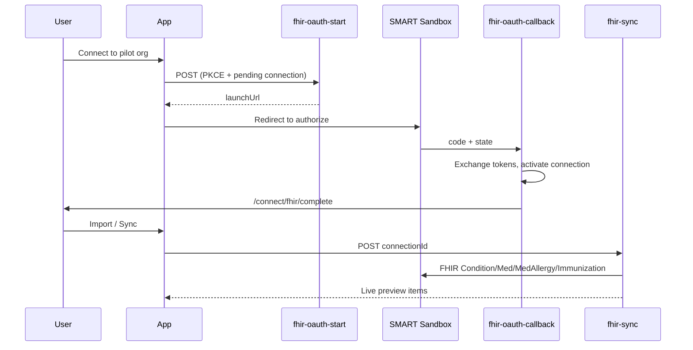

# HealthVault — Architecture Memory

## DIY EHR / SMART on FHIR (Phase B pilot)

Two provider concepts in the app:

| Concept | Tables | Purpose |
|---------|--------|---------|
| Care network | `providers`, `pharmacies` | User's saved doctors/pharmacies |
| EHR connections | `provider_connections`, `provider_organizations` | Digital record import via OAuth + FHIR |

Pilot org: **SMART Health IT Sandbox (Pilot)** — seeded in `provider_organizations` with SMART R4 sandbox endpoints.

### OAuth + sync flow

### Edge functions

| Function | Role |
|----------|------|
| `fhir-oauth-start` | Creates pending `provider_connections` row + PKCE state; returns SMART authorize URL |
| `fhir-oauth-callback` | Exchanges code for tokens; sets connection `active`; redirects to app |
| `fhir-sync` | Fetches FHIR resources with stored token; returns import preview |

### Key files

- `supabase/functions/fhir-oauth-start/`, `fhir-oauth-callback/`, `fhir-sync/`
- `supabase/functions/_shared/smart-oauth.ts`, `fhir-resources.ts`
- `src/lib/network/fhir-oauth-api.ts` — client calls to edge functions
- `src/pages/FhirConnectCompletePage.tsx` — post-OAuth landing (`/connect/fhir/complete`)

### Secrets required to activate

- `FHIR_CLIENT_ID` (required)
- `FHIR_CLIENT_SECRET` (optional — confidential clients only)
- `APP_URL` — app origin for post-OAuth redirect
- `FHIR_REDIRECT_URI` — optional; defaults to `{SUPABASE_URL}/functions/v1/fhir-oauth-callback`

### Connection strategies (priority order)

1. **Existing connection** — active `provider_connections` → sync immediately
2. **Direct provider connection** — SMART on FHIR via org OAuth endpoints
3. **Epic connection** — same OAuth path when org has Epic endpoints configured
4. **Manual fallback** — `record-request` Edge Function (email + secure upload)

Keragon is optional fallback only (`providers` POST with `connection_method: keragon`); DIY path above is preferred.
